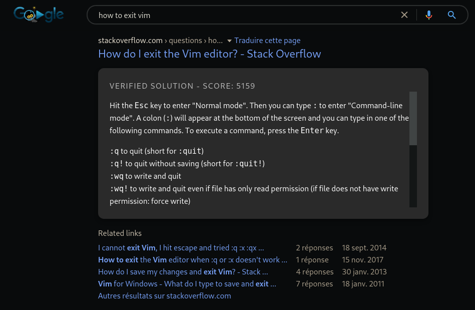

# codesearch
A browser extension that adds code snippets to search results

## How to install?
Since I use only Chrome, I'll not add guide fot other browsers.
I'll eventually edit it for those browsers but it's not my priority right now.

**Chrome :**
- Clone this repo
- Enable developer mode
- Go to chrome://extensions
- Click on `Load unpacked`
- Select the repo folder
